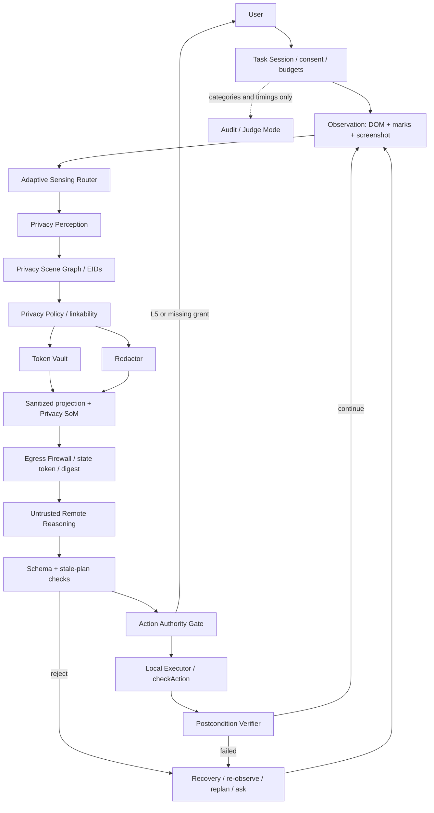
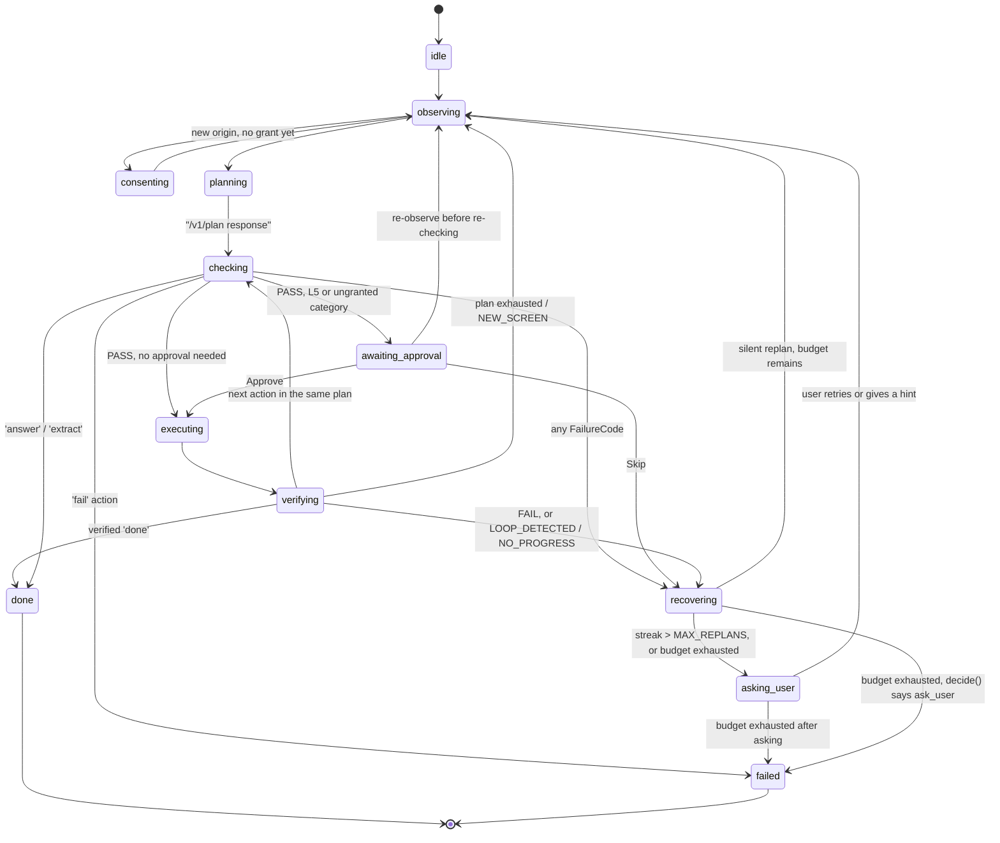

# Aegis — Architecture v6

Aegis is **a trusted local control plane around an untrusted remote agent**. It is a Chrome and
Firefox MV3 extension plus a FastAPI server, built for SIH26171 (ISRO / Department of Space).
The browser owns privacy, consent, identity, freshness and execution. The remote model proposes;
it cannot grant itself authority or disclose information the local policy withheld.

## Modules and interfaces

1. **Task Session** owns per-site, per-task consent, budgets and a minimal in-memory audit log; it creates and ends the panel's session and clears every grant and secret at task end.
2. **Observation** captures DOM, marks and screenshot with local freshness metadata; it returns a `LocalOnly<Observation>` through a thin capture-only background router.
3. **Adaptive Sensing Router** chooses reuse, privacy/UI detector and OCR work, detector resolution, server image size and element budget from screen change and local budgets, and keeps measured counters.
4. **Privacy Perception** combines privacy tags, autocomplete, field context and rules/checksums plus previously vaulted values into local detections; later stages add vision, OCR and NER through explicit hooks.
5. **Privacy Scene Graph** joins observations, detections and policy decisions under one session-local EID per element and one opaque state token per sealed observation; it exposes local and outbound projections.
6. **Privacy Policy** decides treatment from sensitivity, necessity, linkability and origin; locked classes cannot be weakened and generated policy data is the single source of defaults.
7. **Token Vault** maps HMAC tokens to local values using a non-extractable per-session key, and permits restoration only inside a matching `type` action on a consented origin.
8. **Redactor** accepts local rectangles and decisions, solid-fills text and unscanned media, blurs faces only, optionally draws a closed-vocabulary type label inside each fill, and returns a verified redacted image.
9. **Privacy Set-of-Marks** draws Scene Graph EIDs on sanitized pixels for remote grounding; it never invents another element identity.
10. **Egress Firewall** validates the outbound draft, scans text/tokens and mask coverage/integrity, and seals immutable canonical bytes with a digest and runtime registry entry for the sole `network.send` path.
11. **Remote Reasoning** uses an open-weight VLM behind an OpenAI-compatible API to return an initial short plan and batched actions echoing `state_token`, with the current image and sanitized text history only.
12. **Action Authority Gate** classifies every proposed action L0–L5, checks consent locally and always asks the user for L5 commits; the classifier is pure in Stage 2.5 and wired in Stage 3.
13. **Local Executor** reacquires by EID/fingerprint, rechecks current state and origin, narrowly restores tokens and executes only locally implemented structured actions.
14. **Postcondition Verifier** checks a structured `expect` after every state-changing action and requires evidence for `done`, using sanitized text for text matches.
15. **Recovery** aborts stale or failed batches, counts failures toward loop/stuck limits, re-observes and replans with a sanitized failure category, or asks the user.
16. **Judge Mode** exposes sealed bytes, decisions and measured timings locally; only Judge/Eval mode may enable temporary local replay, off by default and auto-deleted.

## Marks and mask verification

The Set-of-Marks (`extension/privacy/som.ts`) runs after redaction and before the downscale, so
tags are drawn at full resolution and stay legible once the image is shrunk to the mode's server
size. A tag carries the EID string and nothing else, and `seal()` refuses any label that is not
`^E[0-9]{1,6}$` or that names an element the payload does not contain.

Tags are never drawn inside a mask. When an element is fully covered by one, its tag goes just
outside the mask edge instead. That rule is what lets `verifyMasks()` keep sampling the image that
actually ships, rather than a pre-marks copy: nothing a mark draws can land where a mask is
checked. Tags also never overlap each other, and an element with nowhere clear to go is left
untagged rather than marked wrongly.

## Labelled masks

A mask hides a value. A **label** says what kind of value it was, drawn inside the mask itself:
`[AADHAAR]` for a blocked value, `[EMAIL#k3f7qa2b]` for a tokenized one, `[IMAGE — not checked]`
for media nothing scanned, and `[FACE]` as a small chip on top of a face's irreversible blur. The
blur itself is never replaced by a label; only the chip is added.

The point is that the sanitized image and the sanitized text say the same thing. Without a label
the server learns what a black box was only from the manifest beside the image, and a vision model
has to correlate a rectangle with a list. With one, the token ID in `[EMAIL#k3f7qa2b]` is character
for character the ID in the `[[PII:EMAIL:k3f7qa2b]]` the text payload already carries. SIH26171
names this "semantic obfuscation" and accepts it as a sanitization method.

Three properties make it safe to draw anything at all on an outbound image:

- **Closed vocabulary.** `privacy/maskLabel.ts` can emit only a `Category` name, optionally plus the
  ID of a vault-issued token, or one of two fixed constants. It has no parameter a raw value could
  travel in, and every string it returns is re-checked against `MASK_LABEL_PATTERN` before it is
  returned. `seal()` then re-checks every label actually drawn, and additionally requires a label's
  token to be one the vault issued *and* one the payload already carries — so the image can never
  say something the text does not.
- **Geometry from the box, never the value.** Font size and position are functions of the mask
  rectangle alone. A long hidden value and a short one of the same category produce identical
  labels, so neither length nor content is inferable from the render. A label that does not fit
  steps down to the category-only form and then to nothing; it is never truncated, because a
  truncated string is not in the vocabulary.
- **Verified in pixels.** See below.

The flag is `AEGIS_CONFIG.MASK_LABELS_ENABLED`, and the panel has a *Labelled masks* toggle beside
*Element ID marks*. See `eval/reports/mask-labels.md` for the measurement that governs the default.

### verifyMasks(): re-render, don't sample

`verifyMasks()` runs two independent checks over every mask, and a mask has to pass both.

The first is the original ring sampling: a few pixels inside each edge, at full resolution and
again after the downscale, must all be the fill colour. It is unchanged.

The second re-renders what the image *should* contain and compares it pixel for pixel, with no
tolerance. The reconstruction starts as a copy of the real masked canvas and replays every mask in
the order the redactor drew them, calling the same `drawMaskFill()` that drew them the first time.
If the shipped image really holds that fill and that label, the replay changes nothing and the two
agree exactly. Starting from a copy rather than a blank canvas is what makes it exact: everything
outside the mask boxes is identical by construction, so the downscale — which mixes neighbouring
pixels across every box edge — produces identical output too, and the shipped PNG can be compared
to the expected one with zero tolerance.

A blur is the one thing that cannot be re-rendered: it is a function of the original pixels, which
are gone by then and must never be kept. Its box is replayed by copying it back out of the real
canvas, so its body is trusted exactly as it was before (blurs were excluded from the old check
outright). What the replay does add for a face is the `[FACE]` chip, which *is* re-rendered and so
*is* checked. A blur's real guarantee remains that it is only applied to FACE/PHOTO and that its
own coverage is checked separately by `seal()`.

This is strictly stronger than sampling. A label that is not the one the payload says it is, a
Set-of-Marks tag painted over a mask, a label drawn past its own edge, a fill of the right colour
but the wrong shape — every one of those is "dark enough" at every sampled point and none of them
survives the comparison.

## Image encoding

The sanitized image is lossless PNG, and stays that way: Stage 3B Part II re-measured the
lossless-WebP switch this doc used to flag as a Stage 8 candidate, by encoding real `kyc.html` and
`pii-zoo.html` captures with `convertToBlob({ type: 'image/webp', quality: 1 })` and diffing every
channel of the decoded result against the source, in both browsers, on both the raw screenshot and
the actual redacted image `seal()` ships (`extension/e2e/webp-pixel-identity.spec.ts`,
`scripts/firefox/e2e.py`'s "WebP quality:1 pixel identity" check).

**Chromium** was bit-exact on every image (0 mismatched channels). **Firefox was not**: the
*redacted* image (the one that actually ships) came back with ~1,260 of 6,451,200 channels
differing by up to 6/255 — small, but not the zero this pipeline's whole soundness argument
(`verifyMasks()` samples the exact bytes that ship) requires. Firefox's *raw* screenshot was
bit-exact, which is the misleading part: measuring only the raw capture — plausibly what an
earlier "0.28-0.32x lossless" measurement did — would have missed the one case that matters.

Size did not favour switching either, even ignoring the Firefox result. The earlier "roughly 3x"
(0.28-0.32x lossless) claim held only for Firefox's *raw* screenshot ratio (0.25-0.29x, measured
this round); on the *redacted* image — small solid-fill rects on a mostly-uniform background,
which PNG already compresses well — lossless WebP was 0.37-0.44x on Firefox and, on Chromium,
**larger than PNG** (0.88-1.52x). Measured sizes (bytes, `quality: 1` WebP vs PNG, current
`AEGIS_CONFIG` capture size):

| Page | Image | Browser | PNG | WebP (lossless) | Ratio | Pixel-identical |
| --- | --- | --- | ---: | ---: | ---: | :-: |
| kyc.html | raw | Chromium | 149,465 | 190,814 | 1.28x | yes |
| kyc.html | redacted | Chromium | 68,419 | 103,810 | 1.52x | yes |
| kyc.html | raw | Firefox | 171,643 | 49,868 | 0.29x | yes |
| kyc.html | redacted | Firefox | 115,358 | 50,610 | 0.44x | **no** (1,260/6,451,200 channels, maxΔ=6) |
| pii-zoo.html | raw | Chromium | 245,838 | 234,666 | 0.96x | yes |
| pii-zoo.html | redacted | Chromium | 128,382 | 112,792 | 0.88x | yes |
| pii-zoo.html | raw | Firefox | 272,753 | 67,848 | 0.25x | yes |
| pii-zoo.html | redacted | Firefox | 207,095 | 76,920 | 0.37x | **no** (1,256/6,451,200 channels, maxΔ=6) |

PNG stays. Conditions: this machine, `AEGIS_CONFIG`'s default capture size, Chromium (Playwright's
bundled build) and Firefox 156.0/geckodriver 0.37.1, one run each — not a generalization claim,
and not a browser-version guarantee (a future Firefox WebP encoder could change this). If encoding
is revisited, it needs a real fallback story for Firefox landing on a byte-identical encoder later
than Chromium, not just a repeat of this measurement.

## Consent and recovery

Consent is per site and task: medium-risk types form one pre-checked group, each high-risk type has
its own approval, and credentials have a separate row. All grants expire at task end. Every L5
commit asks again. A re-hydration category/origin mismatch aborts the remaining batch: type nothing
more, re-observe and replan with a sanitized failure note. Never skip ahead to a possible Submit.

Answers are the one place a token is resolved without being written anywhere. An `answer` or
`extract` result reaches the user through `vault.resolveForDisplay()`, which returns an opaque
`DisplayOnlyText` rather than a string, so the value can be rendered in the panel and cannot be
handed to the page, a URL, storage or the network.
Unknown commit-like actions default to L5. Duplicate identity uncertainty blocks L3+ targeting.

The remote agent can request context with a reason and a kind, never hidden/redacted EIDs or region
identifiers. Only the local router can choose a minimum policy-compliant expansion under budget.

Consent is scoped **per origin**, not per task: `TaskRunner` keeps a `Map<origin, Set<Category>>`
(`this.grants`), and a task that touches a second origin — a cross-origin iframe, a real navigation
mid-task — gets asked again for that origin specifically before anything on it can be acted on.
Nothing about a grant on origin A implicitly extends to origin B; this falls directly out of the map
being keyed by origin, not out of any check that has to remember to look one up.

## Task loop state machine

`extension/agent/runAgentLoop.ts` (`TaskRunner`) drives one task through the pure reducer in
`extension/agentHost/task/state.ts`; illegal transitions throw rather than being silently
coerced, which is what caught a real bug this stage (see below). This is the common path, not
every edge in the transition table — `state.ts` is the source of truth.

Stop is reachable from every non-terminal state (`taskReducer` special-cases `next === 'stopped'`
regardless of the current state) and always wins: it aborts the in-flight step's signal, clears the
vault and task text, and calls `endSession` — there is no state this can leave a task stuck in.

**A bug this exact diagram exists because of.** `awaiting_approval -> observing` was missing from
the transition table until Stage 3B Part II: `runAgentLoop.ts` re-observes after every approval
(the human may have changed the page while deciding, and it must never execute from a stale
snapshot), but the reducer had no path for that specific transition, so `taskReducer` threw, and
the loop's own top-level catch turned that into a hard `failed` — on the very first approved L4 or
L5 action of *any* task. It survived review and the reducer's own unit tests because those tests
exercised `awaiting_approval` only via `checking` (the "reject" edge), never via the
observe-after-approval edge the real loop actually takes. Found by driving an approval through the
real extension in a real browser, not by reasoning about the reducer in isolation — the same reason
this diagram is checked against `state.ts` rather than the other way around.

## Executor limitations

`extension/agent/executor.ts`'s own docstring: *"Synthetic events are `isTrusted=false`; no
debugger access."* Two concrete consequences:

- Every event the executor dispatches (`click`, `pointerdown`/`up`, `input`, `change`, `keydown`
  et al.) is a synthetic `Event`/`PointerEvent`/`KeyboardEvent`, not a real OS-level input event.
  Page script that branches on `event.isTrusted` can distinguish Aegis's actions from a real user's,
  and some browser-gated behaviors (a native `<input type=file>` picker, a payment-sheet API, a
  popup blocked without a trusted gesture) simply will not fire from a synthetic event at all — not
  a bypass Aegis chooses not to use, a capability the browser itself withholds from any extension
  that isn't using `chrome.debugger` (which Aegis deliberately does not use; AGENTS.md invariant).
- `EXEC_UNTRUSTED_REJECTED` (`verifier.ts`) is the verifier's own name for the resulting failure
  mode: an `expect` that doesn't hold and `execution.changed === false` — the page visibly declined
  to react to the synthetic event, rather than the action targeting the wrong thing. Recovery
  treats this like any other verify failure (replan, then ask), not a special case, but it is worth
  reading correctly when it shows up: it usually means the control needs a real user gesture, not
  that the plan or the target was wrong.

## Verifier result codes

`extension/agent/verifier.ts -> verify()` returns one of three verdicts. `PASS` needs no code.
`UNVERIFIABLE` (code `UNVERIFIABLE`) means the action carried no `expect` the verifier knows how to
check — treated as a pass only below L3, since a low-authority action has little to verify and
blocking progress on it would cost more than the small risk. `FAIL` carries one of:

| Code | Meaning |
| --- | --- |
| `VALUE_MISMATCH` | A `type` action's own execution reported `match: false` — what actually landed in the field doesn't match what was sent, checked before `expect` is even consulted. |
| `EXPECT_FAILED` | One or more of the action's `expect` conditions (`visible`, `enabled`, `has_value`, `modal_open`, `text_present`, `url_path_prefix`, `no_validation_error`) evaluated false against the current scene. |
| `EXEC_UNTRUSTED_REJECTED` | Same failed conditions, but `execution.changed === false` — see "Executor limitations" above. |

These are verifier-internal; the broader set of `FailureCode`s recovery and the Authority Gate deal
with (`TARGET_MISSING`, `FP_MISMATCH`, `TOKEN_TYPE_MISMATCH`, `CONTEXT_DENIED`, `LOOP_DETECTED`,
...) lives in `agent/checks.ts` and `agent/recovery.ts`, enumerated in full in
`shared/schema/payload.v2.d.ts`'s `HistoryEntry['code']` union — every one of the seven Stage 3A
adversarial scenarios maps to a specific code there, re-verified through the full agent loop in
`extension/e2e/agent-malicious.spec.ts` and recorded in `eval/reports/stage3-tasks.md`.

## Runtime and trust boundary

The privacy pipeline, vault and session live in the side panel/sidebar document, never in Chrome's
terminable service worker. Background routes captures and retains no raw values or screenshots.
Closing the panel ends the session. React is used for panel UI only; content scripts are plain TS.
No remote code, runtime code generation, selectors from the server, or page ids/classes outbound.
Schema v2 is JSON Schema draft 2020-12, generated TS plus tested Pydantic mirrors; validators are
precompiled at build time to respect CSP. `send(SanitizedPayload)` is the only page-data network path;
`GET /health` is the only exception and carries no page data.

## Three kinds of claims

- **Architecture:** raw page values never leave the browser; only the local executor acts. These are invariants, enforced at the network and action boundaries.
- **Implementation choices:** WXT MV3, in-memory HMAC, DOM rules, PNG export and the current size defaults describe this implementation; they are not comparative performance results.
- **Evaluation methodology:** baseline v2 defines labelled typos as positives, unlabelled near-misses as negatives and states the corpus and conditions. Stage 4 adds three held-out splits, impossible tasks and false-success measurement. Recall on our own small page is not a generalization claim.

## Separate knobs

Local privacy-detector input size (candidate 640 fast / 1280 accurate) is independent of sanitized
server image size (candidate ~768 wide balanced). The former controls local detection; the latter
controls remote layout readability and egress cost. Current config defaults are implementation
choices and must be measured before tuning. **Paper numbers are candidate operating points, never
claims.** PNG is used now to keep mask verification lossless; WebP/encoding evaluation is Stage 8.

See [STAGES.md](STAGES.md) for scope, [policy.yaml](policy.yaml) for policy and authority defaults,
[threat_model.md](threat_model.md) for threats, and [AGENTS.md](../AGENTS.md) for invariants.
