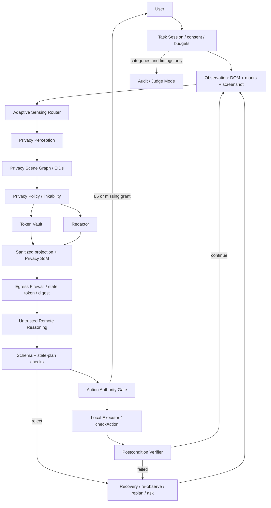

# Aegis — Architecture v6

Aegis is **a trusted local control plane around an untrusted remote agent**. It is a Chrome and
Firefox MV3 extension plus a FastAPI server, built for SIH26171 (ISRO / Department of Space).
The browser owns privacy, consent, identity, freshness and execution. The remote model proposes;
it cannot grant itself authority or disclose information the local policy withheld.

## Modules and interfaces

1. **Task Session** owns per-site, per-task consent, budgets and a minimal in-memory audit log; it creates and ends the panel's session and clears every grant and secret at task end.
2. **Observation** captures DOM, marks and screenshot with local freshness metadata; it returns a `LocalOnly<Observation>` through a thin capture-only background router.
3. **Adaptive Sensing Router** chooses reuse, privacy/UI detector and OCR work, detector resolution, server image size and element budget from screen change and local budgets, and keeps measured counters.
4. **Privacy Perception** combines privacy tags, autocomplete, field context and rules/checksums plus previously vaulted values into local detections; later stages add vision, OCR and NER through explicit hooks.
5. **Privacy Scene Graph** joins observations, detections and policy decisions under one session-local EID per element and one opaque state token per sealed observation; it exposes local and outbound projections.
6. **Privacy Policy** decides treatment from sensitivity, necessity, linkability and origin; locked classes cannot be weakened and generated policy data is the single source of defaults.
7. **Token Vault** maps HMAC tokens to local values using a non-extractable per-session key, and permits restoration only inside a matching `type` action on a consented origin.
8. **Redactor** accepts local rectangles and decisions, solid-fills text and unscanned media, blurs faces only, and returns a verified redacted image.
9. **Privacy Set-of-Marks** draws Scene Graph EIDs on sanitized pixels for remote grounding; it never invents another element identity.
10. **Egress Firewall** validates the outbound draft, scans text/tokens and mask coverage/integrity, and seals immutable canonical bytes with a digest and runtime registry entry for the sole `network.send` path.
11. **Remote Reasoning** uses an open-weight VLM behind an OpenAI-compatible API to return an initial short plan and batched actions echoing `state_token`, with the current image and sanitized text history only.
12. **Action Authority Gate** classifies every proposed action L0–L5, checks consent locally and always asks the user for L5 commits; the classifier is pure in Stage 2.5 and wired in Stage 3.
13. **Local Executor** reacquires by EID/fingerprint, rechecks current state and origin, narrowly restores tokens and executes only locally implemented structured actions.
14. **Postcondition Verifier** checks a structured `expect` after every state-changing action and requires evidence for `done`, using sanitized text for text matches.
15. **Recovery** aborts stale or failed batches, counts failures toward loop/stuck limits, re-observes and replans with a sanitized failure category, or asks the user.
16. **Judge Mode** exposes sealed bytes, decisions and measured timings locally; only Judge/Eval mode may enable temporary local replay, off by default and auto-deleted.

## Marks and mask verification

The Set-of-Marks (`extension/privacy/som.ts`) runs after redaction and before the downscale, so
tags are drawn at full resolution and stay legible once the image is shrunk to the mode's server
size. A tag carries the EID string and nothing else, and `seal()` refuses any label that is not
`^E[0-9]{1,6}$` or that names an element the payload does not contain.

Tags are never drawn inside a mask. When an element is fully covered by one, its tag goes just
outside the mask edge instead. That rule is what lets `verifyMasks()` keep sampling the image that
actually ships, rather than a pre-marks copy: nothing a mark draws can land where a mask is
checked. Tags also never overlap each other, and an element with nowhere clear to go is left
untagged rather than marked wrongly.

## Image encoding

The sanitized image is lossless PNG, and stays that way: Stage 3B Part II re-measured the
lossless-WebP switch this doc used to flag as a Stage 8 candidate, by encoding real `kyc.html` and
`pii-zoo.html` captures with `convertToBlob({ type: 'image/webp', quality: 1 })` and diffing every
channel of the decoded result against the source, in both browsers, on both the raw screenshot and
the actual redacted image `seal()` ships (`extension/e2e/webp-pixel-identity.spec.ts`,
`scripts/firefox/e2e.py`'s "WebP quality:1 pixel identity" check).

**Chromium** was bit-exact on every image (0 mismatched channels). **Firefox was not**: the
*redacted* image (the one that actually ships) came back with ~1,260 of 6,451,200 channels
differing by up to 6/255 — small, but not the zero this pipeline's whole soundness argument
(`verifyMasks()` samples the exact bytes that ship) requires. Firefox's *raw* screenshot was
bit-exact, which is the misleading part: measuring only the raw capture — plausibly what an
earlier "0.28-0.32x lossless" measurement did — would have missed the one case that matters.

Size did not favour switching either, even ignoring the Firefox result. The earlier "roughly 3x"
(0.28-0.32x lossless) claim held only for Firefox's *raw* screenshot ratio (0.25-0.29x, measured
this round); on the *redacted* image — small solid-fill rects on a mostly-uniform background,
which PNG already compresses well — lossless WebP was 0.37-0.44x on Firefox and, on Chromium,
**larger than PNG** (0.88-1.52x). Measured sizes (bytes, `quality: 1` WebP vs PNG, current
`AEGIS_CONFIG` capture size):

| Page | Image | Browser | PNG | WebP (lossless) | Ratio | Pixel-identical |
| --- | --- | --- | ---: | ---: | ---: | :-: |
| kyc.html | raw | Chromium | 149,465 | 190,814 | 1.28x | yes |
| kyc.html | redacted | Chromium | 68,419 | 103,810 | 1.52x | yes |
| kyc.html | raw | Firefox | 171,643 | 49,868 | 0.29x | yes |
| kyc.html | redacted | Firefox | 115,358 | 50,610 | 0.44x | **no** (1,260/6,451,200 channels, maxΔ=6) |
| pii-zoo.html | raw | Chromium | 245,838 | 234,666 | 0.96x | yes |
| pii-zoo.html | redacted | Chromium | 128,382 | 112,792 | 0.88x | yes |
| pii-zoo.html | raw | Firefox | 272,753 | 67,848 | 0.25x | yes |
| pii-zoo.html | redacted | Firefox | 207,095 | 76,920 | 0.37x | **no** (1,256/6,451,200 channels, maxΔ=6) |

PNG stays. Conditions: this machine, `AEGIS_CONFIG`'s default capture size, Chromium (Playwright's
bundled build) and Firefox 156.0/geckodriver 0.37.1, one run each — not a generalization claim,
and not a browser-version guarantee (a future Firefox WebP encoder could change this). If encoding
is revisited, it needs a real fallback story for Firefox landing on a byte-identical encoder later
than Chromium, not just a repeat of this measurement.

## Consent and recovery

Consent is per site and task: medium-risk types form one pre-checked group, each high-risk type has
its own approval, and credentials have a separate row. All grants expire at task end. Every L5
commit asks again. A re-hydration category/origin mismatch aborts the remaining batch: type nothing
more, re-observe and replan with a sanitized failure note. Never skip ahead to a possible Submit.

Answers are the one place a token is resolved without being written anywhere. An `answer` or
`extract` result reaches the user through `vault.resolveForDisplay()`, which returns an opaque
`DisplayOnlyText` rather than a string, so the value can be rendered in the panel and cannot be
handed to the page, a URL, storage or the network.
Unknown commit-like actions default to L5. Duplicate identity uncertainty blocks L3+ targeting.

The remote agent can request context with a reason and a kind, never hidden/redacted EIDs or region
identifiers. Only the local router can choose a minimum policy-compliant expansion under budget.

## Runtime and trust boundary

The privacy pipeline, vault and session live in the side panel/sidebar document, never in Chrome's
terminable service worker. Background routes captures and retains no raw values or screenshots.
Closing the panel ends the session. React is used for panel UI only; content scripts are plain TS.
No remote code, runtime code generation, selectors from the server, or page ids/classes outbound.
Schema v2 is JSON Schema draft 2020-12, generated TS plus tested Pydantic mirrors; validators are
precompiled at build time to respect CSP. `send(SanitizedPayload)` is the only page-data network path;
`GET /health` is the only exception and carries no page data.

## Three kinds of claims

- **Architecture:** raw page values never leave the browser; only the local executor acts. These are invariants, enforced at the network and action boundaries.
- **Implementation choices:** WXT MV3, in-memory HMAC, DOM rules, PNG export and the current size defaults describe this implementation; they are not comparative performance results.
- **Evaluation methodology:** baseline v2 defines labelled typos as positives, unlabelled near-misses as negatives and states the corpus and conditions. Stage 4 adds three held-out splits, impossible tasks and false-success measurement. Recall on our own small page is not a generalization claim.

## Separate knobs

Local privacy-detector input size (candidate 640 fast / 1280 accurate) is independent of sanitized
server image size (candidate ~768 wide balanced). The former controls local detection; the latter
controls remote layout readability and egress cost. Current config defaults are implementation
choices and must be measured before tuning. **Paper numbers are candidate operating points, never
claims.** PNG is used now to keep mask verification lossless; WebP/encoding evaluation is Stage 8.

See [STAGES.md](STAGES.md) for scope, [policy.yaml](policy.yaml) for policy and authority defaults,
[threat_model.md](threat_model.md) for threats, and [AGENTS.md](../AGENTS.md) for invariants.
